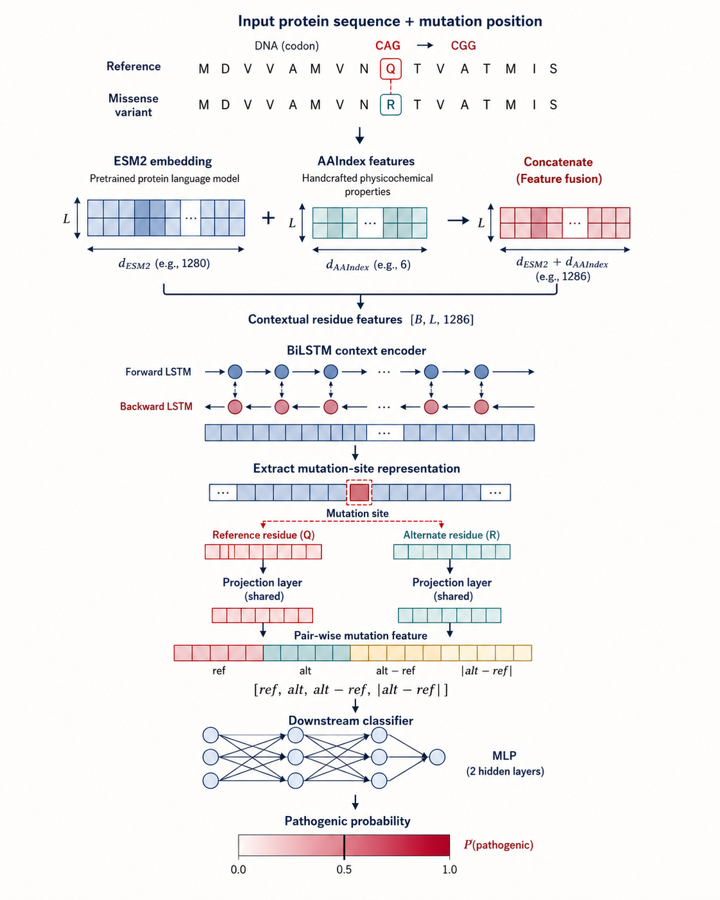
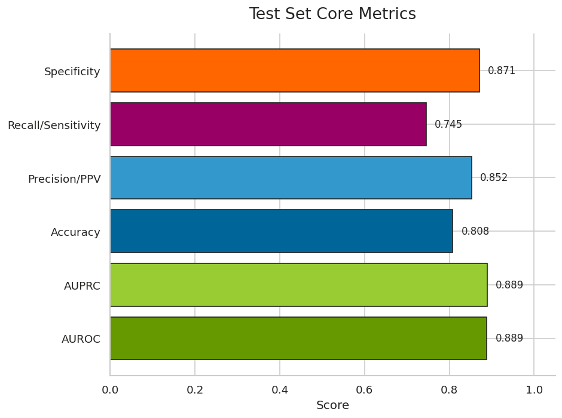

# DuckMissense

DuckMissense is a deep learning project for binary pathogenicity prediction of
protein missense variants. The model compares the reference and mutated protein
sequence windows around a mutation site and predicts whether the variant is
pathogenic.

## Model Overview

The current model uses a two-branch architecture:

- Reference sequence window and mutated sequence window are encoded separately.
- ESM2 residue embeddings are concatenated with AAIndex physicochemical features.
- A BiLSTM encoder extracts mutation-site representations.
- Pairwise features are built from `ref`, `alt`, `alt - ref`, and `|alt - ref|`.
- A downstream classifier outputs the pathogenicity logit.



## Performance

The final reported checkpoint is `mlp_exp9_final.pt`, evaluated on a balanced
test set of 5,000 variants.

| Metric | Value |
| --- | ---: |
| AUROC | 0.8885 |
| AUPRC | 0.8894 |
| Accuracy | 0.8080 |
| Balanced Accuracy | 0.8080 |
| Precision / PPV | 0.8522 |
| Recall / Sensitivity | 0.7452 |
| Specificity | 0.8708 |
| F1 | 0.7951 |
| MCC | 0.6209 |
| Log Loss | 0.4735 |



In short, the model has good overall discrimination ability. Under the default
threshold `0.5`, positive predictions are relatively reliable, while the main
remaining issue is missed pathogenic variants.

## Quick Prediction

Single-variant prediction:

```bash
/home/xuyzh/miniconda3/envs/esm/bin/python script/predict.py \
  --model model/mlp_exp9_final.pt \
  --ref-seq "MEEPQSDPSVEPPLSQETFSDLWKLLPENNVLSPLPSQAMDDLMLSPDDIEQWFTEDPGPDEAPRMPEAAPPVAPAPAAPTPAAPAPAPSWPLSSSVPSQKTYQGSYGFRLGFLHSGTAKSVTCTYSPALNKMFCQLAKTCPVQLWVDSTPPPGTRVRAMAIYKQSQHMTEVVRRCPHHERCSDSDGLAPPQHLIRVEGNLRVEYLDDRNTFRHSVVVPYEPPEVGSDCTTIHYNYMCNSSCMGGMNRRPILTIITLEDSSGNLLGRNSFEVRVCACPGRDRRTEEENLRKKGEPHHELPPGSTKRALPNNTSSSPQPKKKPLDGEYFTLQIRGRERFEMFRELNEALELKDAQAGKEPGGSRAHSSHLKSKKGQSTSRHKKLMFKTEGPDSD" \
  --position 175 \
  --alt-aa H \
  --threshold 0.5
```

Batch prediction:

```bash
/home/xuyzh/miniconda3/envs/esm/bin/python script/predict.py \
  --model model/mlp_exp9_final.pt \
  --input-csv example/TP53_variants.csv \
  --output example/TP53_predictions.csv \
  --threshold 0.5 \
  --batch-size 32
```

Accepted batch input formats:

- `ref_seq` or `sequence`
- either `protein_variant` such as `R175H`
- or `position` plus `alt_aa`

Prediction output includes:

- raw `logit`
- pathogenic probability
- threshold
- binary prediction label
- `pathogenic` / `benign` decision

## Main Scripts

| File | Purpose |
| --- | --- |
| `script/Data_process.ipynb` | Raw data exploration and dataset construction |
| `script/map_refseq.py` | Map source-specific IDs to reference protein sequences |
| `script/prepare_data.py` | Build reference/mutated windows and train/val/test splits |
| `script/aaindex.py` | Encode amino acids with AAIndex features |
| `script/dataloader.py` | PyTorch dataset and collator |
| `script/model.py` | ESM2 + AAIndex + BiLSTM model |
| `script/train.py` | Training and validation loop |
| `script/test_evaluation.ipynb` | Test-set evaluation and visualization |
| `script/predict.py` | Standalone inference script |

## Data Sources

The project integrates missense variants from:

- ClinVar
- COSMIC Cancer Mutation Census
- UniProt humsavar

Large raw data files, processed datasets, cached sequences, TensorBoard logs,
and model checkpoints are intentionally not tracked by Git.

## Repository Notes

This repository contains the source code and lightweight examples. Model weights
and large datasets should be stored separately, for example with Git LFS,
release assets, cloud storage, or a local artifact directory.
